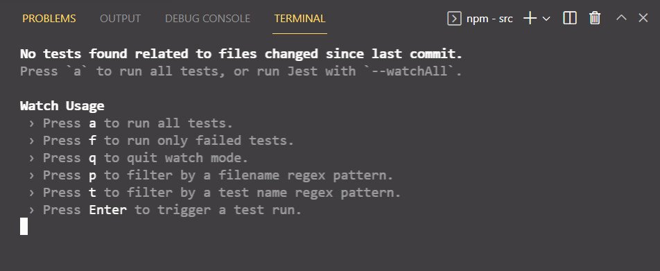
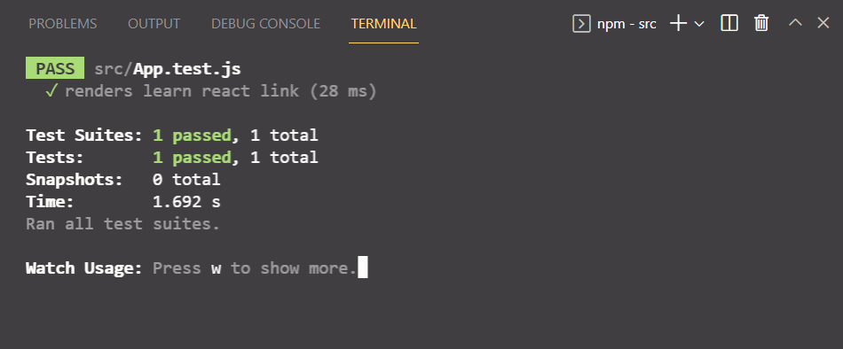
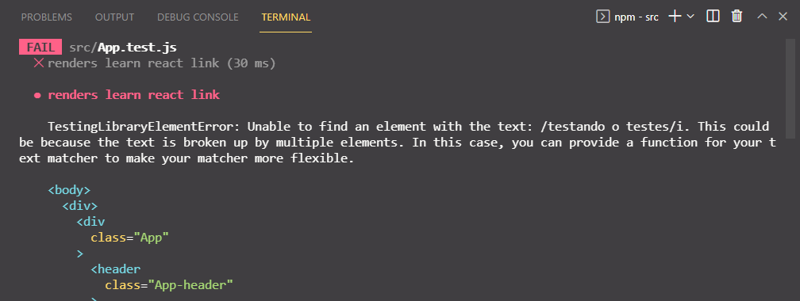
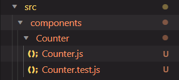
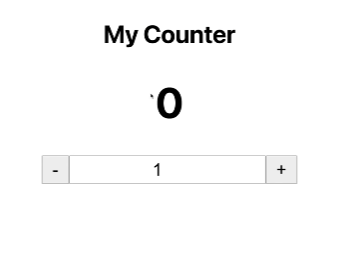
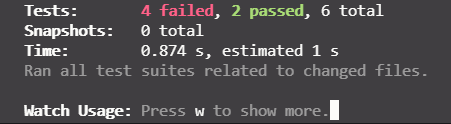

# RTL Testes automatizados em React


[TOC]

---


<br>

## O que vamos aprender ?

O teste de software é um método para determinar se o software real atende aos requisitos esperados, e garantir que o produto esteja livre de defeitos. 

A [RTL (React Testing Library)](https://github.com/testing-library/react-testing-library) é uma solução muito leve para testar os componentes do React. Ele fornece funções em cima do [ReactDom (react-dom)](https://pt-br.reactjs.org/docs/react-dom.html) de uma forma que incentiva melhores práticas de teste. Seu princípio orientador é:

> Quanto mais seus testes se assemelham à forma como o software é usado, mais confiança eles podem lhe dar.

Mesmo não sendo a solução de [maior adoção](https://www.npmtrends.com/enzyme-vs-react-testing-library) **[(enzyme)](https://github.com/enzymejs/enzyme)**, desenvolvida pela **Airbnb**, ambas as bibliotecas usam [Jest](https://jestjs.io/pt-BR/), que já vimos em blocos anteriores e **RTL **é a biblioteca recomendada pela [documentação](https://reactjs.org/docs/testing.html).

Dessa forma, hoje você irá aprender a escrever testes em React! Usando as ferramentas oferecidas tanto para teste de componentes, quanto comportamentos e simulação eventos.

<br>

---

<br>


## Você será capaz de:

- Entender e utilizar Queries (seletores) da React-Testing-Library;
- Simulação de eventos de usuário;
- Testar fluxos lógicos síncronos e assíncronos;
- Escrever testes que resistem a refatoração da estrutura dos componentes, sem necessidade de serem refatorados(escalabilidade).

<br>

---

<br>

## Porque isso é importante?

Mas afinal, se a `react-testing-library` não é a mais usada, porque não aprendemos `enzyme`?

- Quando usamos `Enzyme` para testar nossos componentes de React, esta biblioteca requer outra biblioteca chamada `“enzyme-adapter-react”`, enquanto RTL não requer nenhuma lib adcional.
- `RTL` requer menos configuração inicial do que `Enzyme`.
- Ambas as bibliotecas usam `Jest`, então, não será um problema se estivermos familiarizados com `Jest`.
- O código RTL é curto, legível, limpo e agradável.
- RTL é feito da perspectiva de **pessoa usuária**, e não de **pessoa desenvolvedora**.
- Permite refatoração da sua arquitetura de componentes.

<br>

---

<br>

## Conteúdos

<br>

A *cobertura de teste* e a *cobertura de código* são métricas para facilitar a avaliação da qualidade dos códigos de aplicativo. 

- A *cobertura de código* é usada durante a execução do aplicativo para determinar o exercício do código.

- A *cobertura do teste* se aplica ao teste geral. 

Mas, ambas as métricas são úteis e significativas para pessoas desenvolvedoras garantirem a qualidade do aplicativo de forma eficiente.

Existem diferentes maneiras de executar a *cobertura de código*, inclusive softwares que checam para nós de forma automática.

**Casos de uso x Cobertura de código**

*Casos de uso* são possibilidades de usos do sistema, como a pessoa usuária interage com ele e o que é esperado ao final de uma interação, tanto no sucesso quanto na falha. Quais os possíveis retornos do seu App caso algo não seja usado como quem desenvolveu imaginou que seria. Logo, é preciso simular o acesso do ponto de vista de quem usa o sistema, e todas as ações que resultam naquele *caso de uso*. Como parte do objetivo de escrever testes baseados em **casos de uso**, você evita incluir detalhes de implementação de seus componentes e, em vez disso, se concentra em fazer seus testes exucutar as ações a que se destinam. 

Seguiremos conhecendo `react-testing-library`, e como fazer testes sempre pensando nesses **casos de uso**.

<br>

---

<br>

### Introdução

Nos conteúdos anteriores, usamos Jest para testar funções, agora usaremos o `RTL` com o objetivo de testar comportamento, como se algo renderizou ou não, depois de uma ação específica da pessoa usuária.

Vamos começar criando um novo App react utilizando os comandos: 

- `npx create-react-app rtl-testes-react`. 

  Esse comando que já conhecemos, vai criar um novo projeto chamado `rtl-testes-react`. A biblioteca de testes já vem instalada no React, mesmo em novos projetos!

- `cd rtl-testes-react` para navegar para o diretório do projeto.

- `code .` para abrir esse diretório no VSCode.

Dentro da Pasta `src` encontraremos o arquivo `App.test.js`


```javascript
import React from 'react';
import { render, screen } from '@testing-library/react';
import App from './App';

test('renders learn react link', () => {
  render(<App />);
  const linkElement = screen.getByText(/learn react/i);
  expect(linkElement).toBeInTheDocument();
});
```


Ele está verificando se algum elemento do componente **`App`** possui o texto "learn react"!

Para executarmos o teste, basta utilizar o comando `npm test` dentro da pasta `src`.

Caso o terminal mostre que não encontrou nenhum teste, podemos apertar a tecla `a` para rodar todos os testes do arquivo.

<br>



<br>

Depois de apertar a tecla `a`, o terminal deve mostrar quais testes passaram ou não.

<br>



<br>

O único teste que tinhamos passou, logo, podemos afirmar que foi renderizado o texto "learn react" dentro do componente <App />. Podemos também intencionalmente mudar o texto "learn react" no código, para nos certificarmos que estamos testando o elemento certo, feito isso, o teste deverá acusar o erro junto de sua descrição.

<br>



<br>

Nas seções seguintes você irá aprender somente os seletores e eventos necessários para a resolução dos exercícios. Não deixe de consultar a documenção se necessário!

<br>

---

<br>

### Renderização

Na `RTL`, utilizamos a função `render()` para simular a renderização de um componente em um browser, dessa forma, é possível simular as interações com o componente. Logo, o primeiro passo para desenvolver um teste é escolher qual o componente que vamos testar.

Exemplo: 

```javascript
import React from 'react';
import App from '../../App';
import { render } from '@testing-library/react';

test('Descrição do teste', () => {
  render(<App />);
});
```

Podemos também renderizar somente o componente que queremos testar na nossa aplicação.

<br>

Exemplo: 

```javascript
import React from 'react';
import ComponenteGenerico from '../../ComponenteGenerico';
import { render } from '@testing-library/react';

test('Descrição do teste', () => {
  render(<ComponenteGenerico />);
});
```

Esse é o primeiro passo para desenvolver um teste, renderizar algo que vai ser testado adiante.

<br>

### Seletores ou Queries

O `seletor ` ou `querie`, é a forma de capturar elementos específicos da nossa aplicação ou componente que desejamos testar. É possível consultar na documentação uma [lista completa](https://testing-library.com/docs/queries/about/) das queries, mas não é necessário saber todas! Use a documentação como material de apoio e consulta, quando não estiver achando o seletor específico para o seu caso.

Exemplo: 

```javascript
test(`Renderiza um input com a label "Pokemon"`, () => {
  render(<App />);
  const inputPokemon = screen.getByLabelText('Pokemon');
  expect(inputPokemon).toBeInTheDocument();
});
```

<br>

Neste exemplo, usamos o seletor `getByLabelText` para selecionar um elemento através do texto da sua `label`. Em seguida, usamos os matchers do próprio `Jest` para realizar o teste. 

No próximo exemplo, vamos utilizar o seletor `getByRole`, para verificar se um botão foi renderizado na tela. 

```react
test('Verificando se existe um botão', () => {
  render(<App />);
  const button = screen.getByRole('button');
  expect(button).toBeInTheDocument();
});
```

<br>

Podemos também verificar se existem múltiplos botões na tela. Digamos que na nossa aplicação existem 4 botões. Nesse caso, podemos utilizar o seletor `getAllByRole` e verificar o comprimento do array de botões que é retornado.

```javascript
test('Verificando se existe quatro botões', () => {
  render(<App />);
  const buttons = screen.getAllByRole('button');
  expect(buttons).toHaveLength(4);
});
```

<br>

Se precisarmos interagir com um botão específico, podemos usar a posição no array de botões que é retornado. Se quisermos usar o último botão da nossa aplicação poderíamos seguir o exemplo:

```javascript
test('Verificando se existe quatro botões', () => {
  render(<App />);
  const lastButton = screen.getAllByRole('button')[3];
  expect(buttons).toBeInTheDocument();
});
```

<br>

> Atenção! Não é considerado uma boa prática desestruturar seletores direto do render do componente!
>
> Exemplo:

```javascript
test('Verificando se existe quatro botões', () => {
  const { getAllByRole } = render(<App />);
  const lastButton = getAllByRole('button')[3];
  expect(buttons).toBeInTheDocument();
});
```
<br>
<br>


### Eventos 

Até o momento, testamos apenas se os elementos estão sendo renderizados ou não, e com a introdução dos **eventos**, podemos começar a testar as interações da pessoa usuária, como a simulação de um clique de botão, ou um texto sendo digitado em um input. Para esses eventos, usaremos a `userEvent`.

 A `user-event` é uma biblioteca que possibilita a simulação das interações de `user` com o `browser`. Quando usamos o comando `create-react-app` para criar um projeto, a biblioteca `user-event` já vem instalada, mas se precisar instalar manualmente o comando é 

```javascript
npm install --save-dev @testing-library/user-event
```

<br>

E para utilizar a biblioteca é necessário importar a biblioteca no arquivo de teste também!

```javascript
import userEvent from '@testing-library/user-event';
```

<br>

Vamos abordar somente as principais ações de usuário, o evento de click do mouse, e o evento de digitar no teclado. Esses são os eventos necessários para fazer os exercícios do dia. Como sempre, não deixe de consultar a [documentação](https://testing-library.com/docs/ecosystem-user-event) para conhecer outros eventos ou tirar dúvidas!

<br>

No exemplo abaixo, a pessoa usuária digita "Pikachu", no input com a label pokémon, e é verificado, se o valor do input é Pikachu.

```javascript
import React from 'react'
import { render, screen } from '@testing-library/react'
import userEvent from '@testing-library/user-event'

test(`Digita Pikachu no input com label "Pokémon"`, () => {
  render(<App />);
  const input = screen.getByLabelText('Pokémon')
  userEvent.type(input, 'Pikachu')
  expect(input.value).toBe('Pikachu')
})
```

<br>

No próximo exemplo, ocorre a simulação do mesmo evento do teste anterior, e a pessoa clica no botão enviar após digitar "Pikachu" no input, e é esperado que o input fique vazio após apertar o botão.

<br>

```javascript
import React from 'react'
import { render, screen } from '@testing-library/react'
import userEvent from '@testing-library/user-event'

test(`Digita Pikachu no input com label "Pokémon"`, () => {
  render(<App />);
  const input = screen.getByLabelText('Pokémon')
  const button = screen.getByRole('button')
  userEvent.type(input, 'Pikachu')
  expect(input.value).toBe('Pikachu')
  userEvent.click(button)
  expect(input.value).toBe('')
})
```
<br>
<br>


---

<br>

## Fixando os aprendizados

<br>

1. Qual o comando utilizado para instalar `react-testing-library` no seu novo projeto ?

   - [ ] `npx react-testing-library`
   - [ ] `npm i react-testing-library `
   - [ ] `npx install react-testing-library`
   - [ ] `npm install react-testing-library`
   - [ ] Não é necessário installar `react-testing-library` em novos projetos

   <br>

2. A `react-testing-library` usa os *matchers* de qual biblioteca?

   - [ ] Mocha
   - [ ] Cypress
   - [ ] Jest
   - [ ] Jasmine
   - [ ] Do próprio RTL

   <br>

3. Qual o matcher é usado para verificar se um seletor/query está no componente renderizado?

   - [ ] `isInTheDocument()`
   - [ ] `toBe()`
   - [ ] `toHaveLength()`
   - [ ] `toBeInTheDocument()`
   - [ ] `toBeTruthy()`

   <br>

4. Os testes em RTL são bem feitos quando desenvolvidos sob a perspectiva de:

   - [ ] Pessoa usuária

   - [ ] Browser

   - [ ] Pessoa Product Owner

   - [ ] Pessoa de Quality Assurance

   - [ ] Pessoa desenvolvedora

     <br>

5. Como é chamada as interação da pessoa usuária com o software, o seus possíveis retornos?

   - [ ] Cobertura de Código/Code coverage
   - [ ] Métricas de teste/Test metrics
   - [ ] Casos de uso/Use cases
   - [ ] Cobertura de teste/Test coverage
   - [ ] Camada de abstração/Abstraction layer

   <br>

6. Qual a biblioteca que usamos preferencialmente para interagir com a aplicação durante os testes?

   - [ ] `userEvent`
   - [ ] `render`
   - [ ] `screen`
   - [ ] `eventDispatcher`
   - [ ] `fireAction`

   <br>

7. Qual é o comando utilizado para rodar os testes?

   - [ ] `npm run test`
   - [ ] `npm run all test`
   - [ ] `npm test`
   - [ ] `npx test`
   - [ ] `npm run jest`

   <br>

8. Qual é a forma correta de simular um click de mouse?

   - [ ] `userEvent.mouse.click()`

   - [ ] `userEvent.keyboard.type()`

   - [ ] `userEvent.type()`

   - [ ] `userEvent('click')`

   - [ ] `userEvent.click()`

   <br>

9. Quais são as propriedades que a função type do userEvent recebe em ordem?

   - [ ] O seletor, e o texto que será escrito pela pessoa usuária.

   - [ ] O seletor e o query.

   - [ ] Somente o text que a pessoa usuária vai escrever.

   - [ ] Um seletor, e uma callback com o texto e o teste que será executado.

   - [ ] Somente o seletor.

     <br>

10. Qual dos imports está correto?

    

    - [ ] `import userEvent from '@testing-library/user-event';`

    - [ ] `import userEvent from '@/user-event';`

    - [ ] `import userEvent from '@user-event';`

    - [ ] `import userEvent from '@react-testing-library/user-event';`

    - [ ] `import userEvent from '@react/user-event';`

      

<br>      

---

<br>

## Vamos Praticar

<br>

Para nossa prática, você deve criar um novo projeto com o comando:

```javascript
npx create-react-app trybe-exercises-rtl-tests
```

<br>

Dentro da pasta `src`, você deve criar uma nova pasta chamada `components`, dentro de `components`, uma pasta com o nome do componente que iremos criar, nesse caso, vamos chamar de `Counter`. Dentro da pasta `Counter`, vamos criar  um arquivo chamado `Counter.js`, e um arquivo chamado `Counter.test.js`. Sua estrutura final deve se parecer com:



<br>

Cole o código abaixo dentro do componente `Counter.js` e `App.js` respectivamente:

```javascript
import React, { Component } from 'react'

class Counter extends Component {
  render() {
    return (
      <div>
        <h2>My Counter</h2>
      </div>
    )
  }
}

export default Counter;

```

```javascript
import './App.css';
import Counter from './components/Counter/Counter'

function App() {
  return (
    <div className="App">
      <Counter />
    </div>
  );
}

export default App;

```

Não se esqueça de deletar o `App.test.js`! Lembre-se que alteramos o conteúdo do App, e não faz mais sentido testar se o link do react é renderizado.

<br>

---

<br>

### Parte 1

Agora que já temos tudo pronto, podemos rodar nossa aplicação com o comando `npm start`e desenvolver nossos primeiros testes!

- Teste se o componente é renderizado dentro do App.
- Teste se o componente possui um título h3 com o conteúdo My Counter

Fizemos nosso primeiro componente, e ele já está sendo testado! :punch:

<br>

Agora, vamos utilizar um conceito que abordamos no [Bloco 7 do primeiro módulo](https://app.betrybe.com/course/fundamentals/introducao-a-javascript-es6-e-testes-unitarios/primeiros-passos-em-jest/eb321d06-e126-4c84-8d7e-6134973bf081/conteudos/5a3f4780-9606-4659-b2b3-184ae28489ec/testando-em-pequenos-passos/13065d32-f596-46ef-84c0-f4df01d8fd2d?use_case=side_bar) e aplicar o TDD ao nosso desenvolvimento! Vamos testar componentes que ainda não existem na aplicação, tendo este pequeno projeto em mente!



<br>

- Teste se tem um Contador que começa com o número 0 quando a aplicação é renderizada.

- Teste se a aplicação tem dois botões.

- Teste se a aplicação tem um input com o valor inicial " 1 ".

- Teste se o conteúdo do primeiro botão é " - ".

- Teste se o conteúdo do segundo botão é '' + ''.

  <br>



<br>

Os ultimos 4 testes vão falhar, afinal, desenvolvemos os testes antes de fazer as implementações. Agora, vamos atender os requisitos desses testes para que eles passem. Lembre-se, se alguma implementação ainda não passar (e estiver funcionando normalmente no app), pode haver algum erro no teste. Nesse caso, devemos revisar o teste para checar se faz sentido com a nossa implementação! :thinking:

<br>

---

<br>

### Parte 2

Nessa parte dos exercícios, vamos dar vida a nossa aplicação e implementar as funcionalidades. Assim poderemos testar a interação de pessoas usuárias com ela.

- Ao clicar no botão " - ", o contador é decrementado pelo valor que está no input.
- Ao clicar no botão " + ", o contador é incrementado pelo valor que está no input.
- Faça o input se tornar um formulário controlado(controlled form).

<br>

Agora que nosso contador funciona, vamos testar as funcionalidades da nossa aplicação com o `user-event`, e desenvolver testes de todos os **casos de uso** (*use cases*) possíveis para nossa aplicação.

- Teste se ao clicar no botão " + " o contador incrementa pelo valor padrão do input.
- Teste se ao clicar no botão " - " o contador decrementa pelo valor padrão do input.
- Teste uma simulação da pessoa usuária digitando " 5 " no input, e apertando no botão de incrementar.
- Teste uma simulação da pessoa usuária digitando " 3 " no input, e apertando no botão de decrementar.
- Teste uma simulação da pessoa usuária digitando " 10 " no input, e apertando no botão de incrementar, e logo em seguida digitando " 3 " no input, e apertando o botão de decrementar.

<br>

---

<br>

### Extra

Nessa parte fica a seu critério, a ordem que você vai desenvolver os requisitos ou os testes. Se desenvolver os testes primeiro, atenda os requisitos e verifique se os testes passaram.

- Adcione um botão com o texto " -5 " ao lado esquerdo do botão com texto " - "

  - Teste se existe o botão.

  - Teste se o texto do botão é " -5 ".

  - Teste se o botão decrementa o contador por 5 caso seja clicado.

 <br>   

- Adcione um botão com o texto " +5 " ao lado direito do botão com texto " + "

  - Teste se existe o botão.

  - Teste se o texto do botão é " +5 ".

  - Teste se o botão incrementa o contador por 5 caso seja clicado.

  <br>  

- Faça o Input ficar com valor vazio se for clicado.

  - Testa se o input fica com o valor vazio quando clicado

<br>

E pra finalizar, atualize o teste que esperava apenas dois botões, para testar se tem 4 botões !

<br>
<br>


---

<br>
<br>


## Recursos Adcionais

- [Use cases for automated manual testing](https://testlio.com/blog/use-cases-for-automated-manual-testing/)

- [Enzyme vs RTL, a mindset shift](https://blog.logrocket.com/enzyme-vs-react-testing-library-a-mindset-shift/)

- [RTL Tutorial](https://www.robinwieruch.de/react-testing-library)

<br>
<br>


---

<br>

## Gabarito

<br>

#### Fixando os aprendizados

1. Qual o comando utilizado para instalar `react-testing-library` no seu novo projeto ?

   - [ ] `npx react-testing-library`
   - [ ] `npm i react-testing-library `
   - [ ] `npx install react-testing-library`
   - [ ] `npm install react-testing-library`
   - [x] Não é necessário installar `react-testing-library` em novos projetos

   

2. A `react-testing-library` usa os *matchers* de qual biblioteca?

   - [ ] Mocha
   - [ ] Cypress
   - [x] Jest
   - [ ] Jasmine
   - [ ] Do próprio RTL

   

3. Qual o matcher é usado para verificar se um seletor/query está no componente renderizado?

   - [ ] `isInTheDocument()`
   - [ ] `toBe()`
   - [ ] `toHaveLength()`
   - [x] `toBeInTheDocument()`
   - [ ] `toBeTruthy()`

   

4. Os testes em RTL são bem feitos quando desenvolvidos sob a perspectiva de:

   - [x] Pessoa usuária

   - [ ] Browser

   - [ ] Pessoa Product Owner

   - [ ] Pessoa de Quality Assurance

   - [ ] Pessoa desenvolvedora

     

5. Como é chamada as interação da pessoa usuária com o software, o seus possíveis retornos?

   - [ ] Cobertura de Código/Code coverage
   - [ ] Métricas de teste/Test metrics
   - [x] Casos de uso/Use cases
   - [ ] Cobertura de teste/Test coverage
   - [ ] Camada de abstração/Abstraction layer

   

6. Qual a biblioteca que usamos preferencialmente para interagir com a aplicação durante os testes?

   - [x] `userEvent`
   - [ ] `render`
   - [ ] `screen`
   - [ ] `eventDispatcher`
   - [ ] `fireAction`

   

7. Qual é o comando utilizado para rodar os testes?

   - [ ] `npm run test`
   - [ ] `npm run all test`
   - [x] `npm test`
   - [ ] `npx test`
   - [ ] `npm run jest`

   

8. Qual é a forma correta de simular um click de mouse?

   - [ ] `userEvent.mouse.click()`

   - [ ] `userEvent.keyboard.type()`

   - [ ] `userEvent.type()`

   - [ ] `userEvent('click')`

   - [x] `userEvent.click()`

   

9. Quais são as propriedades que a função type do userEvent recebe em ordem?

   - [x] O seletor, e o texto que será escrito pela pessoa usuária.

   - [ ] O seletor e o query.

   - [ ] Somente o text que a pessoa usuária vai escrever.

   - [ ] Um seletor, e uma callback com o texto e o teste que será executado.

   - [ ] Somente o seletor.

     

10. Qual dos imports está correto?

    

    - [ ] `import userEvent from '@react/user-event';`

    - [ ] `import userEvent from '@/user-event';`

    - [ ] `import userEvent from '@user-event';`

    - [ ] `import userEvent from '@react-testing-library/user-event';`

    - [x] `import userEvent from '@testing-library/user-event';`

      

      


---


####  Parte 1

##### Counter.js

```javascript
import React, {Component} from 'react';

class Counter extends Component {
  render() {
    return (
      <main>
        <h3>My Counter</h3>
        <h2>0</h2>
        <button type="button">-</button>
        <input
          type="number"
          defaultValue="1"
        />
        <button type="button">+</button>
      </main>
    );
  }
}

export default Counter;

```


##### Counter.test.js

```javascript
import React from 'react';
import { render, screen } from '@testing-library/react';
import Counter from '../Counter/Counter';
import App from '../../App';

describe('Testa o componente App', () => {
  it('Deve renderizar o Counter dentro do App', () => {
    render(<App />);
    expect(screen.getByRole('heading', {
      name: 'My Counter',
      level: 3,
    })).toBeInTheDocument();
  });

  it(`Deve renderizar um Heading h3 com o texto "My Counter" no componente
    Counter`, () => {
    render(<Counter />);
    expect(
      screen.getByRole('heading', {
        name: 'My Counter',
        level: 3,
      }),
    ).toBeInTheDocument();
  });
});

describe('Testa o contador', () => {
  it('Deve renderizar um contador com o texto começando por "0"', () => {
    render(<Counter />);
    expect(screen.getByText('0')).toBeInTheDocument();
  });

  it('Deve ter dois botões', () => {
    render(<Counter />);
    expect((screen.getAllByRole('button')).toHaveLength(2));
  });

  it('Deve ter um input com o valor inicial de " 1 "', () => {
    render(<Counter />);
    const input = screen.getByRole('spinbutton');
    expect(input.value).toBe('1');
  });

  it('Deve ter " - " no texto do primeiro botão', () => {
    render(<Counter />);
    const firstButton = screen.getAllByRole('button')[0];
    expect(firstButton.textContent).toBe('-');
  });

  it('Deve ter " + " no texto do segundo botão', () => {
    render(<Counter />);
    const secondButton = screen.getAllByRole('button')[1];
    expect(secondButton.textContent).toBe('+');
  });
});

```


---

#### Parte 2 

##### Counter.js

```javascript
import React, { Component } from 'react';

class Counter extends Component {
  constructor(props) {
    super(props);
    this.state = {
      counter: 0,
      inputValue: 1,
    };
    this.incrementCounter = this.incrementCounter.bind(this);
    this.decrementCounter = this.decrementCounter.bind(this);
    this.handleChange = this.handleChange.bind(this);
  }

  handleChange({ target }) {
    const { value } = target;
    this.setState({
      inputValue: +value,
    });
  }

  incrementCounter() {
    const { counter, inputValue } = this.state;
    this.setState({
      counter: counter + inputValue,
    });
  }

  decrementCounter() {
    const { counter, inputValue } = this.state;
    this.setState({
      counter: counter - inputValue,
    });
  }

  // Outra opção para a função acima
  // handleChange = (e) => {
  //   this.setState({
  //     inputValue: Number(e.target.value),
  //   });
  // };

  render() {
    const { counter, inputValue } = this.state;
    const { decrementCounter, incrementCounter, handleChange } = this;
    return (
      <div className="container">
        <h3>My Counter</h3>
        <h2>{ counter }</h2>
        <button type="button" onClick={ decrementCounter }>
          -
        </button>
        <input
          className="input"
          data-testid="input"
          type="number"
          defaultValue={ inputValue }
          onChange={ handleChange }
        />
        <button type="button" onClick={ incrementCounter }>
          +
        </button>
      </div>
    );
  }
}

export default Counter;


```

##### Counter.test.js

```javascript
import React from 'react';
import { render, screen } from '@testing-library/react';
import Counter from '../Counter/Counter';
import App from '../../App';


describe('Testa os use cases da aplicação', () => {
  it(`Deve incrementar o contador pelo valor do input 
    ao clicar no botão " + ".`, () => {
    render(<Counter />);
    const secondButton = screen.getAllByRole('button')[1];
    const counter = screen.getByRole('heading', { level: 2 });
    userEvent.click(secondButton);
    expect(counter.textContent).toBe('1');
  });

  it(`Deve decrementar o contador pelo valor do input 
    ao clicar no botão " - ".`, () => {
    render(<Counter />);
    const firstButton = screen.getAllByRole('button')[0];
    const counter = screen.getByRole('heading', { level: 2 });
    userEvent.click(firstButton);
    expect(counter.textContent).toBe('-1');
  });

  it(`Deve incrementar por 5 ao inserir "5" no input e clicar no botão " + "
    pela pessoa usuária`, () => {
    render(<Counter />);
    const INPUT = 5;
    const secondButton = screen.getAllByRole('button')[1];
    const counter = screen.getByRole('heading', { level: 2 });
    const input = screen.getByTestId('input');
    userEvent.type(input, ' {backspace} 5');
    expect(input).toHaveValue(INPUT);
    userEvent.click(secondButton);
    expect(counter.textContent).toBe('5');
  });

  it(`Deve decrementar por 3 ao inserir "3" no input e clicar no botão " - "
    pela pessoa usuária`, () => {
    render(<Counter />);
    const INPUT = 3;
    const firstButton = screen.getAllByRole('button')[0];
    const counter = screen.getByRole('heading', { level: 2 });
    const input = screen.getByTestId('input');
    userEvent.type(input, ' {backspace} 3');
    expect(input).toHaveValue(INPUT);
    userEvent.click(firstButton);
    expect(counter.textContent).toBe('-3');
  });

  it(`Deve incrementar por 10 ao inserir "10" no input e clicar no botão " + "
    e logo em seguida decrementar 3, após digitar "3" no input e clicar
    no botão " - "  pela pessoa usuária`, () => {
    render(<Counter />);
    const FIRST_INPUT = 10;
    const SECOND_INPUT = 3;
    const firstButton = screen.getAllByRole('button')[0];
    const secondButton = screen.getAllByRole('button')[1];
    const counter = screen.getByRole('heading', { level: 2 });
    const input = screen.getByTestId('input');
    userEvent.type(input, '0');
    expect(input).toHaveValue(FIRST_INPUT);
    userEvent.click(secondButton);
    expect(counter.textContent).toBe('10');
    userEvent.type(input, ' {backspace} {backspace} 3');
    expect(input).toHaveValue(SECOND_INPUT);
    userEvent.click(firstButton);
    expect(counter.textContent).toBe('7');
  });
});

```


---

#### Extra

##### Counter.js

```javascript
import React, { Component } from 'react';

class Counter extends Component {
  constructor(props) {
    super(props);
    this.state = {
      counter: 0,
      inputValue: 1,
    };
    this.incrementCounter = this.incrementCounter.bind(this);
    this.incrementCounterBy5 = this.incrementCounterBy5.bind(this);
    this.decrementCounter = this.decrementCounter.bind(this);
    this.decrementCounterBy5 = this.decrementCounterBy5.bind(this);
    this.handleChange = this.handleChange.bind(this);
    this.resetInput = this.resetInput.bind(this);
  }

  handleChange({ target }) {
    const { value } = target;
    this.setState({
      inputValue: +value,
    });
  }

  // Outra opção para a função acima
  // handleChange = (e) => {
  //   this.setState({
  //     inputValue: Number(e.target.value),
  //   });
  // };

  resetInput(e) {
    e.target.value = "";
  }

  incrementCounter() {
    const { counter, inputValue } = this.state;
    this.setState({
      counter: counter + inputValue,
    });
  }

  incrementCounterBy5() {
    const { counter } = this.state;
    this.setState({
      counter: counter + 5,
    });
  }

  decrementCounter() {
    const { counter, inputValue } = this.state;
    this.setState({
      counter: counter - inputValue,
    });
  }

  decrementCounterBy5() {
    const { counter } = this.state;
    this.setState({
      counter: counter - 5,
    });
  }

  render() {
    const { counter, inputValue } = this.state;
    const { 
      decrementCounter, 
      decrementCounterBy5, 
      incrementCounter, 
      incrementCounterBy5, 
      handleChange, 
      resetInput } = this;
    return (
      <div className="container">
        <h3>My Counter</h3>
        <h2>{ counter }</h2>
        <button type="button" onClick={ decrementCounterBy5 } >
          -5
        </button>
        <button type="button" onClick={ decrementCounter }>
          -
        </button>
        <input
          className="input"
          data-testid="input"
          type="number"
          value={ inputValue }
          onChange={ handleChange }
          onFocus={(e) => resetInput(e)}
        />
        <button type="button" onClick={ incrementCounter }>
          +
        </button>
        <button type="button" onClick={ incrementCounterBy5 }>
          +5
        </button>
      </div>
    );
  }
}

export default Counter;
```


##### Counter.test.js

```javascript
import React from 'react';
import { render, screen } from '@testing-library/react';
import userEvent from '@testing-library/user-event';
import Counter from '../Counter/Counter';
import App from '../../App';

describe('Testa o componente App', () => {
  it('Deve renderizar o Counter dentro do App', () => {
    render(<App />);
    expect(screen.getByRole('heading', {
      name: 'My Counter',
      level: 3,
    })).toBeInTheDocument();
  });

  it(`Deve renderizar um Heading h3 com o texto "My Counter" no componente
    Counter`, () => {
    render(<Counter />);
    expect(
      screen.getByRole('heading', {
        name: 'My Counter',
        level: 3,
      }),
    ).toBeInTheDocument();
  });
});

describe('Testa o contador', () => {
  it('Deve renderizar um contador com o texto começando por "0"', () => {
    render(<Counter />);
    expect(screen.getByText('0')).toBeInTheDocument();
  });

  it('Deve ter quatro botões', () => {
    render(<Counter />);
    expect(screen.getAllByRole('button')).toHaveLength(4);
  });

  it('Deve ter um input com o valor inicial de " 1 "', () => {
    render(<Counter />);
    const input = screen.getByRole('spinbutton');
    expect(input.value).toBe('1');
  });

  it('Deve ter " - " no texto do primeiro botão', () => {
    render(<Counter />);
    const firstButton = screen.getAllByRole('button')[1];
    expect(firstButton.textContent).toBe('-');
  });

  it('Deve ter " + " no texto do segundo botão', () => {
    render(<Counter />);
    const secondButton = screen.getAllByRole('button')[2];
    expect(secondButton.textContent).toBe('+');
  });
});

describe('Testa os use cases da aplicação', () => {
  it(`Deve incrementar o contador pelo valor do input 
    ao clicar no botão " + ".`, () => {
    render(<Counter />);
    const secondButton = screen.getAllByRole('button')[2];
    const counter = screen.getByRole('heading', { level: 2 });
    userEvent.click(secondButton);
    expect(counter.textContent).toBe('1');
  });

  it(`Deve decrementar o contador pelo valor do input 
    ao clicar no botão " - ".`, () => {
    render(<Counter />);
    const firstButton = screen.getAllByRole('button')[1];
    const counter = screen.getByRole('heading', { level: 2 });
    userEvent.click(firstButton);
    expect(counter.textContent).toBe('-1');
  });

  it(`Deve incrementar por 5 ao inserir "5" no input e clicar no botão " + "
    pela pessoa usuária`, () => {
    render(<Counter />);
    const INPUT = 5;
    const secondButton = screen.getAllByRole('button')[2];
    const counter = screen.getByRole('heading', { level: 2 });
    const input = screen.getByTestId('input');
    userEvent.type(input, ' {backspace} 5');
    expect(input).toHaveValue(INPUT);
    userEvent.click(secondButton);
    expect(counter.textContent).toBe('5');
  });

  it(`Deve decrementar por 3 ao inserir "3" no input e clicar no botão " - "
    pela pessoa usuária`, () => {
    render(<Counter />);
    const INPUT = 3;
    const firstButton = screen.getAllByRole('button')[1];
    const counter = screen.getByRole('heading', { level: 2 });
    const input = screen.getByTestId('input');
    userEvent.type(input, ' {backspace} 3');
    expect(input).toHaveValue(INPUT);
    userEvent.click(firstButton);
    expect(counter.textContent).toBe('-3');
  });

  it(`Deve incrementar por 10 ao inserir "10" no input e clicar no botão " + "
    e logo em seguida decrementar 3, após digitar "3" no input e clicar
    no botão " - "  pela pessoa usuária`, () => {
    render(<Counter />);
    const FIRST_INPUT = 10;
    const SECOND_INPUT = 3;
    const firstButton = screen.getAllByRole('button')[1];
    const secondButton = screen.getAllByRole('button')[2];
    const counter = screen.getByRole('heading', { level: 2 });
    const input = screen.getByTestId('input');
    userEvent.type(input, '10');
    expect(input).toHaveValue(FIRST_INPUT);
    userEvent.click(secondButton);
    expect(counter.textContent).toBe('10');
    userEvent.type(input, '3');
    expect(input).toHaveValue(SECOND_INPUT);
    userEvent.click(firstButton);
    expect(counter.textContent).toBe('7');
  });
});

describe('Testa a implementação dos novos botões', () => {
  it(`Deve existir um botão com o texto " -5 " ao lado esquerdo
    do botão com texto " - "`, () => {
    render(<Counter />);
    const firstButton = screen.getAllByRole('button')[0];
    const counter = screen.getByRole('heading', { level: 2 });
    expect(firstButton.textContent).toBe('-5');
    userEvent.click(firstButton);
    expect(counter.textContent).toBe('-5');
  })

  it(`Deve existir um botão com o texto " +5 " ao lado direito
    do botão com texto " + "`, () => {
    render(<Counter />);
    const lastButton = screen.getAllByRole('button')[3];
    const counter = screen.getByRole('heading', { level: 2 });
    expect(lastButton.textContent).toBe('+5');
    userEvent.click(lastButton);
    expect(counter.textContent).toBe('5');
  })

  it(`Deve limpar o Input ao clicar`, () => {
    render(<Counter />);
    const input = screen.getByRole('spinbutton');
    userEvent.click(input);
    expect(input.textContent).toBe('');
  })
});


```


---


### Nota pessoal sobre o processo seletivo

Desde já, gostaria de dizer que é um honra fazer parte desse processo e me diverti muito produzindo esse conteúdo. Gerou certa dúvida como condensar o conteúdo para ser consumido em 30 minutos, e como produzir o equivalente a 1 hora de exercícios para tão pouco tempo de conteúdo, logo, pensei em utilizar os vídeos da Trybe que já estão na plataforma, ou produzir meus próprios vídeos com voz alterada e imagem camuflada, para assim ter conteúdo suficiente e os exercícios não se tornassem repetitivos. No entanto, após uma leitura mais detalhada do desafio, entendi que todo conteúdo deveria ser autoral, e a questão do vídeo poderia trazer viés a avalização, logo, trago essa versão do desafio, que apresenta textos mais densos em detrimento da qualidade dos exercícios. 

Agradeço a oportunidade e aguardo com ansiedade o retorno!

